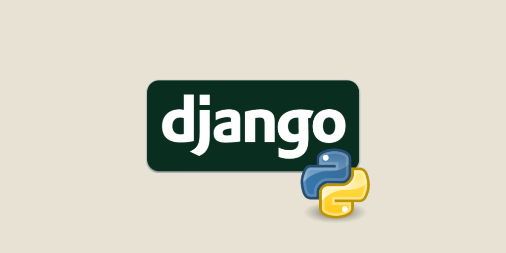

# Django Template

A production-ready Django template with Docker, UV package manager, and vendor file management.



## Tech Stack

- **Backend:** Django, Django REST Framework
- **Database:** PostgreSQL
- **Other:** Docker,Uv package manager, Shell

you can also use integrate with:

- **Frontend:** React, Next.js, TypeScript
- **Caching/Message Broker:** Redis
- **Web Server/Reverse Proxy:** Nginx

## Prerequisites

- Python 3.11+
- [uv package manager](https://docs.astral.sh/uv/getting-started/installation/)
- Docker (optional, for containerized setup)
- Node.js and npm (optional, for frontend vendor management)

## Quick Start

### 1. Clone and Initialize

```bash
git clone  my-project
cd my-project
python init_project.py
```

The initialization script will:

- Update project name and description in configuration files
- Set up Python virtual environment (using uv)
- Install dependencies (using uv)
- Generate uv.lock file

### 2. Environment Variables

Copy the example environment file and configure it:

```bash
cp .env.example .env
```

Edit `.env` with your configuration (database credentials, secret key, etc.)

**Optional:** Create a symlink for the backend directory (Linux/macOS):

```bash
ln -s ../.env backend/.env
```

### 3. Run Migrations

```bash
cd backend
uv run manage.py makemigrations
uv run manage.py migrate
```

Make sure you have [uv package manager](https://docs.astral.sh/uv/getting-started/installation/) installed! (feel free to read [uv documents](https://docs.astral.sh/uv/getting-started/))
You can install it using pip:

```bash
pip install uv
```

### 4. Start Development Server

```bash
uv run manage.py runserver
```

Visit `http://localhost:8000` to see your application!

## Manual Setup (Alternative)

If you prefer to set up manually without using `init_project.py`:

1. **Install uv package manager:**

   ```bash
      pip install uv
   ```

2. **Update project configuration:**
   - Edit `backend/pyproject.toml` (change `name` and `description`)
   - Edit `README.md` (change project title and description)

3. **Install Python dependencies:**

   ```bash
      cd backend
      uv sync
   ```

4. **Setup environment variables:**

   ```bash
      cp .env.example .env
      # Edit .env with your configuration
   ```

5. **Run migrations:**

   ```bash
      uv run manage.py makemigrations
      uv run manage.py migrate
   ```

6. **Create superuser (optional):**

   ```bash
      uv run manage.py createsuperuser
   ```

7. **Start the server:**

   ```bash
      uv run manage.py runserver
   ```

## Frontend Vendor Management (Optional)

This template includes tools to manage frontend vendor files (Bootstrap, jQuery, etc.):

### Setup

1. **Initialize npm (if not already done):**

   ```bash
      npm init -y
   ```

2. **Install frontend packages:**

   ```bash
      npm install bootstrap
      npm install @fortawesome/fontawesome-free
      # ... other packages
   ```

3. **Configure vendor files:**

   Edit `update_vendor_config.json` to specify which files to copy:

   ```json
      {
      "files": [
         {
            "src": "node_modules/bootstrap/dist/css/bootstrap.min.css",
            "dest": "backend/static/vendor/bootstrap/css/bootstrap.min.css"
         }
      ]
      }
   ```

4. **Update vendor files:**

   ```bash
      python update_vendors.py
   ```

   This will copy the specified files from `node_modules` to your Django static directory.

## Running with Docker

1. **Setup environment variables:**

   ```bash
      cp .env.example .env
      # Edit .env with your Docker-specific configuration
   ```

2. **Build and start all services:**

   ```bash
      docker compose up --build
   ```

3. **Run migrations (in a separate terminal):**

   ```bash
      docker compose exec backend python manage.py migrate
   ```

4. **Create superuser (optional):**

   ```bash
      docker compose exec backend python manage.py createsuperuser
   ```

   The application will be available at `http://localhost:8000`

## Project Structure

```plaintext
my-project/
├── backend/                    # Django project
│   ├── apps/                   # Django applications
│   │   ├── accounts/          # User authentication & management
│   │   └── api/               # API endpoints
│   ├── core/                   # Core project configuration
│   │   ├── settings/          # Settings modules (base, dev, prod)
│   │   ├── asgi.py
│   │   ├── urls.py
│   │   └── wsgi.py
│   ├── static/                 # Source static files (CSS, JS, images)
│   ├── staticfiles/            # Collected static files (generated)
│   ├── templates/              # Django HTML templates
│   ├── media/                  # User uploads (generated)
│   ├── manage.py               # Django management script
│   └── pyproject.toml          # Python dependencies (uv)
├── dockerfiles/                # Docker configuration files
│   ├── backend.Dockerfile
│   └── nginx.Dockerfile
├── update_vendors.py           # Script to update vendor files
├── update_vendor_config.json   # Vendor file configuration
├── init_project.py             # Project initialization script
├── compose.yaml                # Docker Compose configuration
├── .env.example                # Environment variables template
├── .gitignore
├── LICENSE
└── README.md
```

## Updating Dependencies

### Python Dependencies

```bash
cd backend
uv add       # Add new package
uv remove    # Remove package
uv sync                    # Sync with pyproject.toml
```

### Frontend Vendor Files

If you're using the vendor management system:

1. Install via npm: `npm install <package-name>`
2. Edit `update_vendor_config.json` to include new files
3. Run: `python update_vendors.py`

## Common Commands

```bash
# Django
uv run manage.py makemigrations    # Create migrations
uv run manage.py migrate           # Apply migrations
uv run manage.py createsuperuser   # Create admin user
uv run manage.py collectstatic     # Collect static files
uv run manage.py test              # Run tests

# Docker
docker compose up                  # Start services
docker compose down                # Stop services
docker compose logs -f backend     # View backend logs
docker compose exec backend bash   # Access backend container

# Vendor Management (optional)
npm install               # Install frontend package
python update_vendors.py           # Copy to Django static
```

## 🤝 Contributing

Contributions are always welcome!
Checkout [Contributing Guide](./CONTRIBUTING.md) for how to contribute instructions.

## License

This project is licensed under the [MIT](https://choosealicense.com/licenses/mit/).
